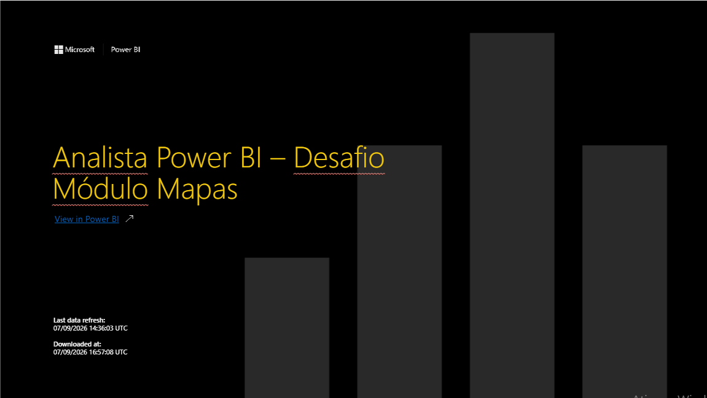
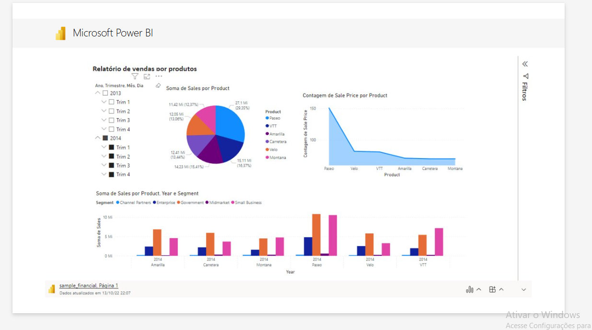
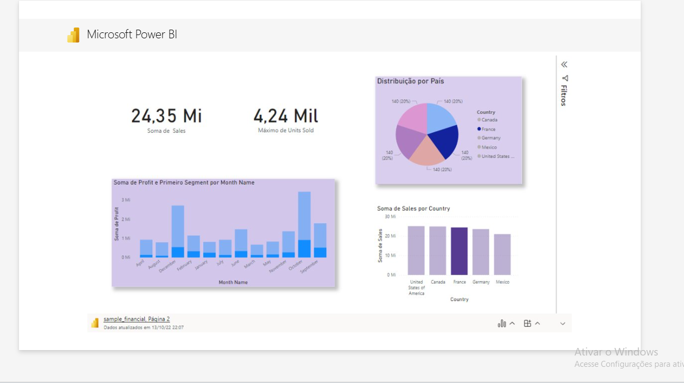
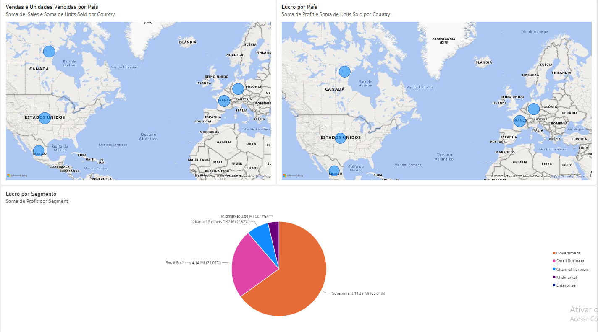

# 📊 Dashboard Financeiro — Power BI Analyst




## 📌 Sobre o projeto

Projeto desenvolvido durante o **Bootcamp Power BI Analyst da DIO**, com foco na prática de **Business Intelligence, análise de dados e visualização de informações utilizando Microsoft Power BI**.

O desafio envolveu a reprodução de páginas apresentadas durante o curso e a criação de uma terceira página para exercitar a construção de visuais, especialmente análises geográficas e de lucratividade.

## 🎯 Objetivo

Apresentar informações financeiras e comerciais de forma visual e intuitiva, permitindo analisar:

- 💰 Vendas (Sales)
- 📈 Lucro (Profit)
- 📦 Unidades vendidas (Units Sold)
- 🌎 Desempenho por país
- 🏢 Desempenho por segmento
- 📊 Desempenho de vendas por produto

## 🛠️ Tecnologias e ferramentas

- Microsoft Power BI
- DAX
- Power BI Service
- Microsoft PowerPoint
- Git e GitHub
- Data Visualization
- Business Intelligence

## 📊 Estrutura do relatório

### 1️⃣ Página 1 — Relatório de Vendas por Produtos

Apresenta análises relacionadas às vendas por produto, período e segmento, utilizando diferentes recursos de visualização do Power BI.



### 2️⃣ Página 2 — Análise Financeira

Apresenta indicadores e análises de vendas, unidades vendidas e distribuição por país.



### 3️⃣ Página 3 — Análise Geográfica e Lucratividade

Página autoral desenvolvida para atender ao desafio do módulo de mapas.

**Visuais principais:**

- 🌎 Vendas e Unidades Vendidas por País
- 💰 Lucro por País
- 🍕 Lucro por Segmento



## 🔎 Principais insights

### 💡 01 — Concentração de lucro

O segmento **Government** representa aproximadamente **65% do lucro** apresentado no gráfico de lucro por segmento, indicando uma concentração significativa da lucratividade nesse segmento.

### 💡 02 — Desempenho geográfico

Os mapas permitem comparar visualmente a contribuição dos diferentes países em relação a vendas, unidades vendidas e lucro.

### 💡 03 — Volume x resultado

A análise conjunta de **Sales, Units Sold e Profit** permite observar a diferença entre volume comercial e contribuição financeira.

## 🎨 Boas práticas aplicadas

- Organização dos visuais por contexto
- Títulos claros e objetivos
- Distribuição equilibrada dos gráficos
- Uso de mapas para análise geográfica
- Uso de gráfico de pizza para participação por segmento
- Utilização de Tooltips para informações complementares
- Hierarquia visual para facilitar a interpretação

## 📐 Conceitos praticados

- Criação e configuração de visuais
- Mapas no Power BI
- Gráficos de pizza, área e colunas
- Hierarquia de datas
- Análise geográfica
- Tooltips
- Formatação de relatórios
- Publicação no Power BI Service
- Integração com PowerPoint
- Versionamento com Git e GitHub

## 📁 Estrutura do repositório

```text
-power-bi-analyst-lucas/
│
├── 📂 dashboard/
│   └── Financial_Report_DIO.pbix
│
├── 📂 presentation/
│   └── Analista-Power-BI-Desafio-Mapas.pptx
│
├── 📂 screenshots/
│   ├── capa.png
│   ├── pagina-1.png
│   ├── pagina-2.png
│   └── pagina-3.png
│
├── 📂 dataset/
│   └── Fonte-do-dataset.md
│
└── README.md
```

## 🚀 Próximas evoluções

- [ ] Criar KPIs adicionais
- [ ] Criar medida de Profit Margin
- [ ] Desenvolver Tooltips personalizados
- [ ] Criar análises adicionais utilizando DAX
- [ ] Adicionar filtros interativos
- [ ] Evoluir a identidade visual do dashboard
- [ ] Criar análises adicionais de rentabilidade
- [ ] Comparar desempenho por país e segmento

## 🌐 Projeto publicado

### Power BI

[🔗 Acessar relatório publicado no Power BI](https://app.powerbi.com/groups/me/reports/42469562-b64b-4f5e-aa6d-92a216ce9ad8/9224676090a70935171e?language=pt-BR&experience=power-bi)

### PowerPoint

[📑 Visualizar apresentação do projeto](https://liveestacio-my.sharepoint.com/:p:/r/personal/202603519449_alunos_estacio_br/_layouts/15/Doc.aspx?sourcedoc=%7B20F3266C-D147-4F3F-889A-48253483DC8F%7D&file=Analista%20Power%20BI%20%E2%80%93%20Desafio%20M%C3%B3dulo%20Mapas.pptx&action=edit)

## 📚 Referência

Desafio desenvolvido com base no **Bootcamp Power BI Analyst da DIO**.

Repositório utilizado como referência:

https://github.com/julianazanelatto/power_bi_analyst

## 👨‍💻 Autor

### Lucas Fonseca

Projeto desenvolvido como parte da minha jornada de aprendizado em **Tecnologia, Business Intelligence e Análise de Dados**.

Atualmente, estou ampliando meus conhecimentos em:

- Power BI
- DAX
- Análise de Dados
- Business Intelligence
- Inteligência Artificial
- Tecnologia da Informação

🔗 **GitHub:** https://github.com/Lucas-pro97

---

⭐ Se este projeto foi útil ou interessante para você, considere deixar uma estrela no repositório!
